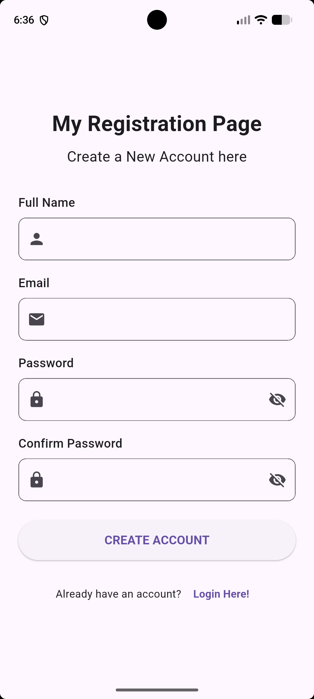

# Flutter Login & Registration Page

A simple Flutter application that provides
Login and Registration pages. The application 
includes form validation, password visibility 
controls, navigation between pages, and 
basic button actions.

## Features

### Login Page

* Application title
* Welcome message
* Email / Username input
* Password input
* Show / Hide password
* Forgot Password option
* Login button
* Link to the Registration page
* Form validation

### Registration Page

* Application title
* Account creation message
* Full Name input
* Email input
* Password input
* Confirm Password input
* Show / Hide password
* Create Account button
* Link back to the Login page
* Form validation

## Screenshots

### Login Page


### Registration Page




## Technologies Used

* Flutter
* Dart
* Android Studio
* Material Design

## How to Run

1. Install Flutter and Android Studio.
2. Clone or download this project.
3. Open the project in Android Studio.
4. Make sure an Android emulator or physical Android device is connected.
5. Run the following command in the project terminal:

flutter pub get

6. Run the application using:

flutter run


## Project Structure

```text
flutter-login-registration-page/
├── android/
├── ios/
├── lib/
│   └── main.dart
├── screenshots/
│   ├── 1_login_page.png
│   ├── 2.png
│   ├── 3.png
│   ├── 4.png
│   ├── 5.png
│   ├── 6.png
│   ├── 7.png
│   ├── 8_registration_page.png
│   ├── 9.png
│   ├── 10.png
│   ├── 11.png
│   ├── 12.png
│   └── 13.png
├── test/
├── pubspec.yaml
└── README.md


